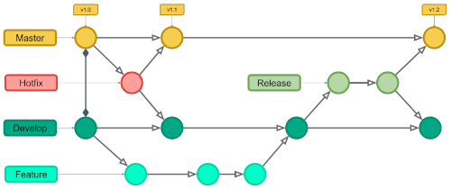
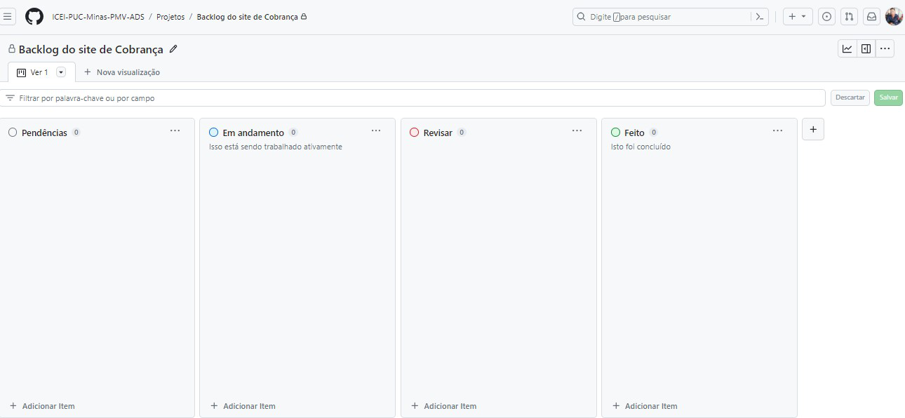

# Metodologia

Neste documento, vamos compartilhar a metodologia que nossa equipe empregou para criar o sistema envio de cobranças. Iremos também apresentar as ferramentas e ambientes que desempenharam um papel fundamental no desenvolvimento do projeto. Isso engloba uma análise detalhada dos diversos ambientes que utilizamos e como organizamos o código-fonte. Além disso, vamos discutir o processo e as ferramentas que empregamos para coordenar e supervisionar nossa equipe durante o projeto.

## Controle de Versão

Para o gerenciamento do código fonte será utilizado o modelo de processo baseado no Git Flow, conforme mostrado na figura a seguir:

- Figura - Fluxo de controle do código fonte

A ferramenta de controle de versão adotada no projeto foi o
[Git](https://git-scm.com/), sendo que o [Github](https://github.com)
foi utilizado para hospedagem do repositório.

O projeto segue a seguinte convenção para o nome de branches:

- `main`: versão estável já testada do software
- `unstable`: versão já testada do software, porém instável
- `testing`: versão em testes do software
- `dev`: versão de desenvolvimento do software

Quanto à gerência de issues, o projeto adota a seguinte convenção para
etiquetas:

- `bug`: Indica um problema inesperado ou comportamento involuntário
- `duplicate`: Indica problemas, pull requests ou discussões
- `help wanted`: Indica que um mantenedor deseja ajudar em um problema ou uma pull request
- `enhancement`: uma funcionalidade precisa ser melhorada
- `invalid`: Indica que um problema, pull request ou discussão já não é relevante
- `documentation`: melhorias ou acréscimos à documentação
- `question`: Indica que um problema, pull request ou discussão precisa de mais informações
- `bug`: uma funcionalidade encontra-se com problemas
- `feature`: uma nova funcionalidade precisa ser implementada
- `wontfix`: Indica que o trabalho não continuará em um problema, pull request ou discussão.

## Relação de Ambientes de Trabalho

Os artefatos do projeto são desenvolvidos a partir de diversas plataformas e a relação dos ambientes com seu respectivo propósito é apresentada na tabela que se segue:

| Ambiente | Plataforma | Link de Acesso|
|----------|------------|----------------|
|Repositório de código fonte| GitHub| https://github.com/ICEI-PUC-Minas-PMV-ADS/pmv-ads-2023-2-e2-proj-int-t11-turma-11-grupo_04|
|Documento de Projeto| GitHub | https://github.com/ICEI-PUC-Minas-PMV-ADS/pmv-ads-2023-2-e2-proj-int-t11-turma-11-grupo_04/tree/main/docs |
|Projeto de Interface e Wireframes|  Figma    |  https://www.figma.com/file/qB86p72XibOUNFAqEdzdkB/Aplica%C3%A7%C3%A3o-Interativa?type=design&node-id=0%3A1&mode=design&t=9fNkZNSJwmd87BWh-1     |
Gerenciamento de Projeto| GitHub | https://github.com/orgs/ICEI-PUC-Minas-PMV-ADS/projects/573/views/1 |
| Comunicação entre os Stakeholders | WhatsApp e Teams | https://www.whatsapp.com/?lang=pt_BR , https://teams.microsoft.com |
| Editor de código | Visual Studio | https://visualstudio.microsoft.com/pt-br/ |

## Gerenciamento de Projeto

A equipe segue abordagens ágeis, com a escolha do Scrum como a estrutura principal para orientar nosso processo de desenvolvimento.
A equipe está organizada da seguinte forma:

**Scrum Master:** 

**Product Owner:** 

**Equipe de Desenvolvimento:** 
- Bárbara Fernandes Sena
- 
- Gleyston Guimarães Silva.
- 
- 
- 

**Equipe de Design:**
- Bárbara Fernandes Sena
- 
- Gleyston Guimarães Silva.
- 
- 
- 

### Processo

Para gerenciar e distribuir as tarefas do projeto, a equipe está utilizando um quadro de tarefas no GitHub com o modelo KANBAN, que está organizado nas seguintes colunas:

- Backlog: É o local onde todas as tarefas que precisam ser realizadas são registradas e isso compõe o Product Backlog. Além disso, todas as atividades que forem identificadas durante o desenvolvimento do projeto devem ser adicionadas a essa mesma lista.

- Em andamento: Nesta coluna, são colocados os cartões de tarefas que estão atualmente em andamento.

- Revisar: Aqui ficam os cartões de tarefas que já foram concluídos, mas que precisam passar por uma avaliação e planejamento da equipe antes de serem movidos para a coluna "FEITO".

- Feito: Esta coluna abriga os cartões de tarefas que já foram executados, revisados e considerados concluídos pela equipe.

O quadro kanban do grupo no GitHub pode ser visualizado no link https://github.com/orgs/ICEI-PUC-Minas-PMV-ADS/projects/573/views/1 e é apresentado, no estado atual, na Figura abaixo:
 

### Ferramentas

As ferramentas empregadas no projeto são:

- Editor de código: Visual Studio Code.
- Ferramentas de comunicação: Whatsapp, teams.
- Ferramentas de desenho de tela (_wireframing_): Figma.

Optamos pelo uso do VS Code devido à sua integração perfeita com o Git e o GitHub. O Microsoft Teams foi selecionado como a plataforma padrão para nossas aulas, e para a criação de diagramas, escolhemos o Figma, que permite a edição colaborativa em tempo real por todos os membros do grupo.
